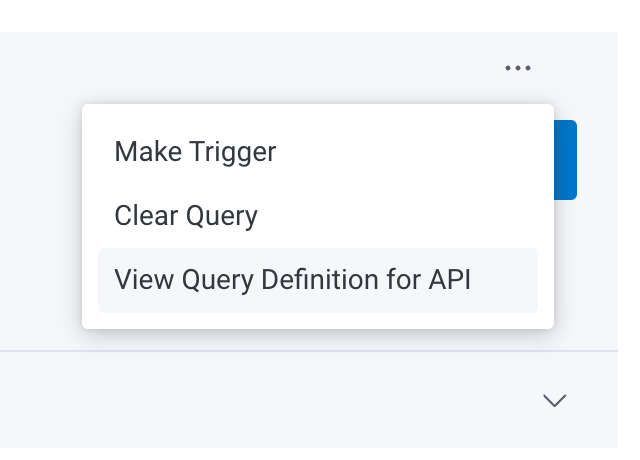

# Rollouts Honeycomb metrics plugin

Below is an example of an `AnalysisTemplate` using the [Honeycomb](https://honeycomb.io/) metrics provider:

```yaml
apiVersion: argoproj.io/v1alpha1
kind: AnalysisTemplate
metadata:
  name: error-rate
spec:
  args:
  - name: service-name
  - name: api-key
    valueFrom:
      secretKeyRef:
        name: honeycomb
        key: api-key
  metrics:
  - name: error-rate
    interval: 5m
    successCondition: result == 0
    failureLimit: 3
    provider:
      prometheus:
        # dataset is optional, defaults to all datasets in the environment
        dataset: my-service 
        apiKey: "{{ args.api-key }}"
        query: |
          {
            "time_range": 600,
            "granularity": 10,
            "breakdowns": [],
            "calculations": [
                {
                    "op": "COUNT"
                }
            ],
            "filters": [
                {
                    "column": "error.object",
                    "op": "does-not-exist"
                }
            ],
            "filter_combination": "AND",
            "orders": [],
            "havings": [],
            "limit": 1000
        }
```
If more than one calculation is specified, then only the first one in the list will be used. The `result` evaluated for the condition is always a scalar and refers to the result
of the specified calculation.  Only the `time_range` should be specified without `start_time` and `end_time`, in which case, the query looks back the specified number of seconds from now.

Queries can be constructed and tested in the Honeycomb UI, and then the query specification can be found by clicking the three dots above the "Run Query" button in the query builder.


The Honeycomb API key must be specified in a Kubernetes `Secret` in the argo-rollouts namespace:
```yaml
apiVersion: v1
kind: Secret
metadata:
  name: honeycomb
type: Opaque
stringData:
  api-key: <honeycomb-api-key>
```
Note that the API key must have the **Manage Queries and Columns** permission.


### Build

To build a release build run the command below:
```bash
make build-plugin
```

To build a debug build run the command below:
```bash
make build-plugin-debug
```

### Maintainers
To create a new release and binaries:
```shell
git tag -a v1.2.3 -m 'Release notes go here'
# Or omit -m and fill in release notes at the prompt
git push origin v1.2.3
```